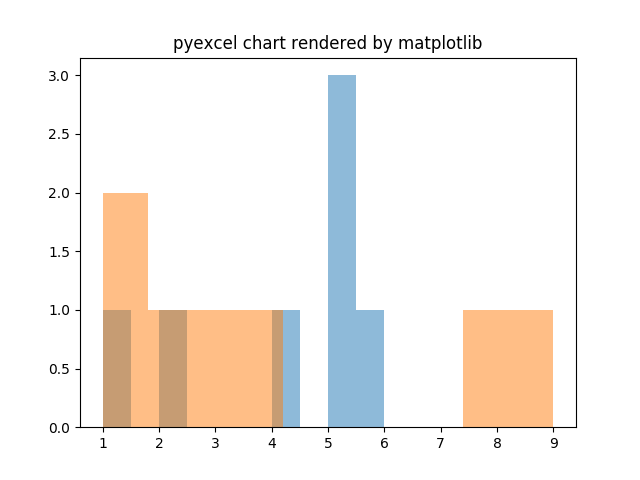

Save pyexcel data as svg chart
================================================================================

Line
--------------------------------------------------------------------------------

		   
Here is the source code using pyexcel:

.. literalinclude:: ../../tests/test_matplot.py
   :lines: 15-29
   :dedent: 4

Histogram
--------------------------------------------------------------------------------

		   
Here is the source code using pyexcel:

.. literalinclude:: ../../tests/test_matplot.py
   :lines: 96-104
   :dedent: 4

Single histogram
********************************************************************************

		   
Here is the source code to draw single sheet histogram:

.. literalinclude:: ../../tests/test_matplot.py
   :lines: 84-91
   :dedent: 4

XY
--------------------------------------------------------------------------------

BASIC
********************************************************************************

Basic XY Lines, drawing cosinus:

		   
Here is the source code using pyexcel:

.. literalinclude:: ../../tests/test_matplot.py
   :lines: 34-48
   :dedent: 4

Single xy line
********************************************************************************

		   
Here is the source code to draw single sheet histogram:

.. literalinclude:: ../../tests/test_matplot.py
   :lines: 53-62
   :dedent: 4

Pie chart
--------------------------------------------------------------------------------

		   
Here is the source code using pyexcel:

.. literalinclude:: ../../tests/test_matplot.py
   :lines: 67-79
   :dedent: 4

Radar chart
--------------------------------------------------------------------------------

.. image:: _static/radar.png
   :width: 600px
   :height: 400px
		   
Here is the source code using pyexcel:

.. literalinclude:: ../../tests/test_matplot.py
   :lines: 87-104
   :dedent: 4

Box chart
--------------------------------------------------------------------------------

.. image:: _static/box.png
   :width: 600px
   :height: 400px
		   
Here is the source code using pyexcel:

.. literalinclude:: ../../tests/test_matplot.py
   :lines: 109-121
   :dedent: 4

Dot chart
--------------------------------------------------------------------------------

.. image:: _static/dot.png
   :width: 600px
   :height: 400px
		   
Here is the source code using pyexcel:

.. literalinclude:: ../../tests/test_matplot.py
   :lines: 126-143
   :dedent: 4

Funnel chart
--------------------------------------------------------------------------------

.. image:: _static/funnel.png
   :width: 600px
   :height: 400px
		   
Here is the source code using pyexcel:

.. literalinclude:: ../../tests/test_matplot.py
   :lines: 148-163
   :dedent: 4

